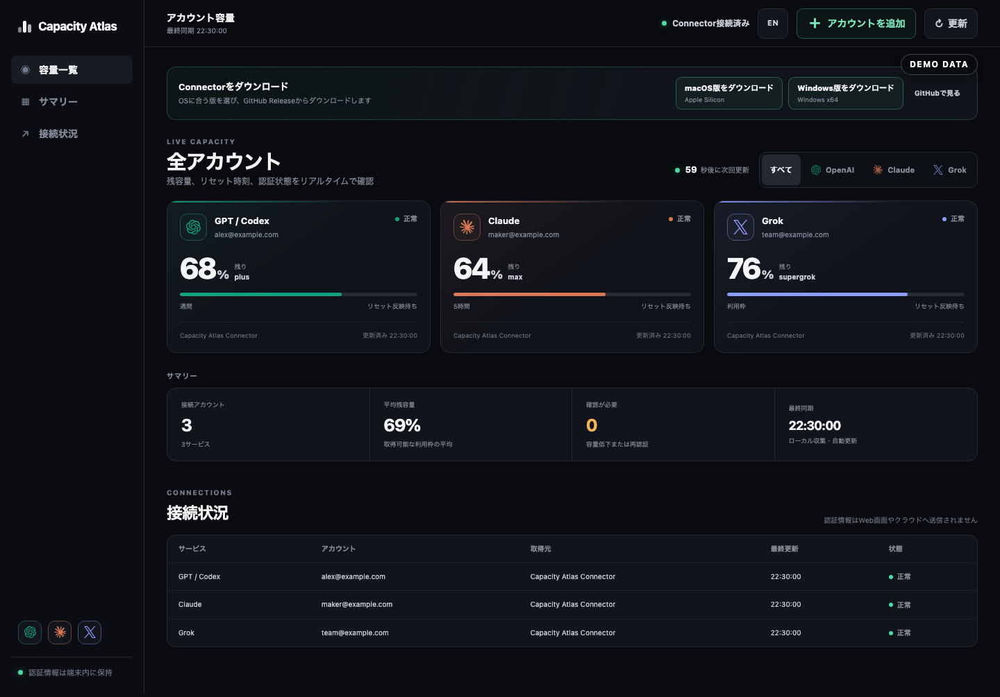

# Capacity Atlas

**日本語** | [English](README.en.md)

**すべてのAI容量を、ひとつの画面に。**

Capacity Atlasは、GPT / OpenAI Codex、Claude、Grokの残容量、リセット日時、認証状態を一画面で確認するローカルファーストのオープンソース管理ツールです。

自動アカウント切替、プロンプト転送、モデル通信のリレーは行いません。



## Download

Node.jsや各社CLIの事前インストールは不要です。

- [macOS Apple Silicon版をダウンロード](https://github.com/meem0601/capacity-atlas/releases/latest/download/Capacity-Atlas-Connector-macOS-arm64.zip)
- [Windows x64版をダウンロード](https://github.com/meem0601/capacity-atlas/releases/latest/download/Capacity-Atlas-Connector-Windows-x64.zip)
- [すべてのReleaseを見る](https://github.com/meem0601/capacity-atlas/releases)

Connectorを起動し、ブラウザで「アカウントを追加」を押してOAuth認証するだけで利用できます。

### macOS Apple Siliconでの初回起動

1. ZIPを展開し、`Capacity Atlas Connector.app`を「アプリケーション」フォルダへ移動します。
2. 現在の配布版はApple公証前です。通常のダブルクリックで警告が出た場合は、アプリを**controlクリック→「開く」→「開く」**の順に選びます。
3. ブラウザが自動で開かない場合は、Connectorアプリをもう一度開きます。安全な一時接続情報は起動時URLで渡すため、URLだけを手入力しません。

対応機種はApple Silicon搭載Macです。警告を許可する前に、GitHub ReleaseのSHA-256とダウンロードしたZIPが一致することを確認してください。

### Windows x64での初回起動

1. ZIPを展開し、フォルダ内のファイルを分離せずそのまま保持します。
2. `Start Capacity Atlas.cmd`をダブルクリックします。
3. 現在の配布版はコード署名前です。SmartScreenが表示された場合は、GitHub Releaseの配布元・ファイル名・SHA-256を確認した場合だけ**「詳細情報」→「実行」**を選びます。
4. ブラウザが自動で開かない場合は、`Start Capacity Atlas.cmd`をもう一度実行します。

PowerShellでSHA-256を確認する例：

```powershell
Get-FileHash .\Capacity-Atlas-Connector-Windows-x64.zip -Algorithm SHA256
```

## 特徴

- 画面内の`EN / JA`ボタンで日英を即時切替し、選択言語を端末内に保存
- 接続済みアカウントがあるサービスだけをフィルターと凡例へ表示
- 起動直後に、接続済みアカウントの残容量とリセット時刻を表示
- OpenAI、Claude、GrokのブラウザOAuthをConnectorから開始
- 同一プロバイダー・同一アカウントの重複接続を1枚へ集約
- Capacity Atlasが作成した管理接続だけを安全に解除
- macOS KeychainおよびWindows / Linuxの保護された認証ファイルに対応
- 認証状態と、一時的な利用枠APIエラーを分離
- ホストされたUIへトークン、Cookie、実利用枠を送信しない
- OAuth待機は15分で自動終了し、画面を閉じた場合も子プロセスを回収

## 構成

1. **Web UI** — 静的なダッシュボード。公開版は <https://capacity-atlas.vercel.app>。
2. **Capacity Atlas Connector** — 各PCの `127.0.0.1:4174` のみで待ち受け、ローカル認証と利用枠取得を担当。
3. **プロバイダー認証** — 「アカウントを追加」からOAuth URLをブラウザで開き、各サービス上で許可。利用者がトークンを貼り付ける必要はありません。

## 対応状況

| サービス | 利用枠取得 | 複数アカウント | 新規認証 |
| --- | --- | --- | --- |
| GPT / Codex | 直接取得 | 分離プロファイル | OpenAIブラウザOAuth |
| Claude | ベストエフォート | 現行版は端末のアクティブな1アカウント | ClaudeブラウザOAuth |
| Grok | ベストエフォート | 現行版は端末のアクティブな1アカウント | xAIブラウザOAuth |

GPT / Codexの認証ヘルパーは配布パッケージへ同梱します。ClaudeとGrokは、初回接続時に各社の公式配布元からConnector専用領域へ取得し、プラットフォーム署名・チェックサムを検証します。

> [!IMPORTANT]
> 各社の残容量取得には、正式な第三者向け安定APIではない部分があります。プロバイダー側の仕様変更により一時的または恒久的に取得できなくなる可能性があります。認証成功と利用枠取得成功は別状態として扱います。

## 開発

必要環境：Node.js 20以上。

```bash
npm ci
npm run check
npm test
npm run build
npm start
```

`npm start`は一時トークン付きのローカル画面を自動で開きます。トークンは標準出力へ表示せず、UIがURL履歴から即時除去してタブ内だけに保持します。UIは60秒間隔で更新し、Connectorは同一結果を最大60秒キャッシュします。

## 再現可能な配布ビルド

```bash
npm run build:release
```

このコマンドは次を行います。

1. `vendor/codex/artifacts.json` に固定したOpenAI公式リリースを取得
2. 公式SHA-256と照合
3. macOS arm64 / Windows x64 Connectorを生成
4. `release/` に配布ZIPを作成

生成済みバイナリ、`release/`、`dist/`、ローカル設定、認証情報はGitへ含めません。

## 安全設計

- Connectorはloopback（`127.0.0.1`）だけで待ち受けます。
- APIのWeb Originは公開版Capacity Atlasか、接続先Connector自身と完全一致するOriginだけを許可します。
- health以外のAPIは起動ごとに生成する32バイト相当の能力トークンを要求し、URL履歴から即時除去してタブ内だけに保持します。
- 実行中メタデータは`~/.capacity-atlas/runtime.json`へ保存し、POSIXでは権限`0600`、WindowsではユーザープロファイルACLで保護します。ランチャー更新時は認証済み終了APIを優先します。
- OAuth待機は15分TTL、明示取消、プロバイダーごと1セッションに制限し、Connector終了時は全子プロセスを回収します。
- 認証出力はトークン形式をマスクしてからUIへ返します。
- 公開Web版は `/api/status` を持たず、認証情報・実アカウントデータを保存しません。
- ブラウザへOAuthトークンを入力・保存させません。
- 通常のOpenAI / Claude / Grok CLI認証は削除しません。Capacity Atlas管理プロフィールだけが解除対象です。

脆弱性報告については [SECURITY.md](SECURITY.md) を参照してください。

## Contributing

IssueとPull Requestを歓迎します。変更前に [CONTRIBUTING.md](CONTRIBUTING.md) を確認してください。

## Attribution

利用枠取得ロジックの調査・移植に、MIT Licenseの[CodexBar](https://github.com/steipete/CodexBar)を参照しています。配布パッケージにはApache-2.0のOpenAI Codex CLIを含みます。詳細は [THIRD_PARTY_NOTICES.md](THIRD_PARTY_NOTICES.md) を参照してください。

OpenAI、Claude、Grokおよび各ロゴは各権利者の商標です。Capacity Atlasは各社の公式製品ではなく、各社による承認・提携を示すものではありません。

## License

[MIT License](LICENSE)
